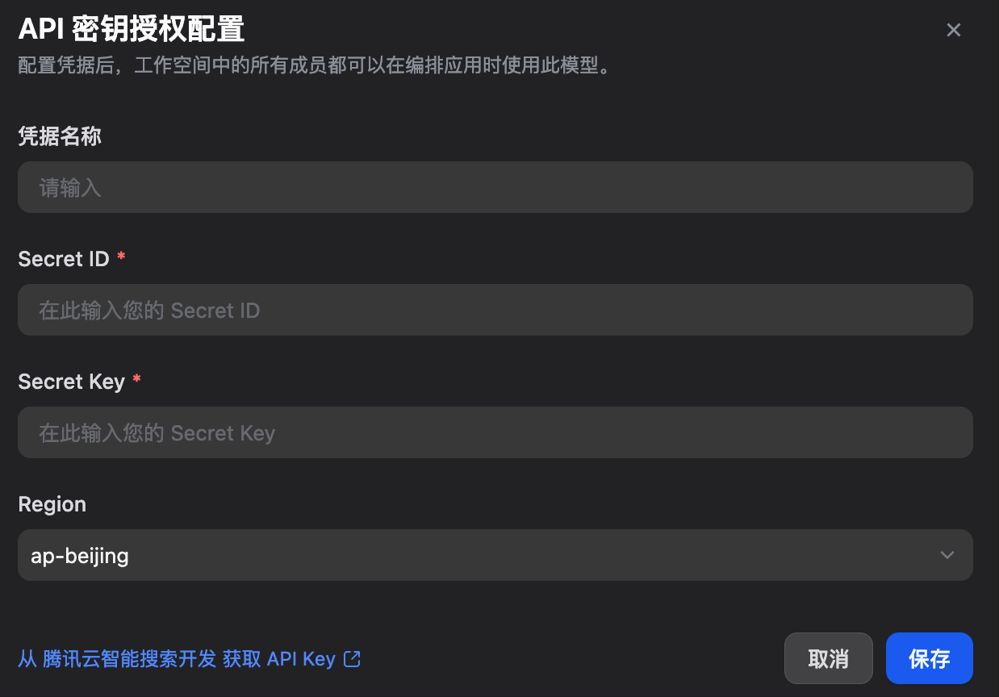

Overview

Tencent Cloud AISearch provides a diverse range of AI models, including text embedding models, reranking models, and large language models (LLMs). This plugin enables developers to seamlessly integrate these powerful models into their applications via API.

Configure

After installing the plugin, configure your Tencent Cloud AiSearch settings in the Model Provider section. This includes:
- Authentication: Secret ID + Secret Key
- Optional Regions: ap-beijing (Beijing), ap-singapore (Singapore)

Save your configuration to start using Tencent Cloud AISearch models.

Get API Key: Tencent Cloud AISearch Console

